<p align="center">
  
</p>

<h1 align="center">Wildlife Distance Calculator</h1>

<p align="center">
  A premium desktop application designed for wildlife researchers to estimate animal distances from camera trap images. The application combines <b>YOLOv5</b> object detection, <b>Dense Prediction Transformer (DPT)</b> monocular depth maps, and a custom neural network regression model (TensorFlow/Keras) to deliver automated, precise distance measurements.
</p>

---

## 📖 คู่มือการใช้งานแอปพลิเคชัน (Step-by-Step User Guide)

แอปพลิเคชันแบ่งกระบวนการทำงานออกเป็น **3 แท็บ (3 ขั้นตอนหลัก)** เพื่อนำคุณตั้งแต่การเตรียมภาพตัวอย่าง การสอน AI ไปจนถึงการคำนวณผลลัพธ์แบบอัตโนมัติ:

```mermaid
graph TD
    subgraph "ขั้นตอนที่ 1: เตรียมข้อมูลสอน AI (Annotate)"
        A[โหลดโฟลเดอร์ภาพอ้างอิง] --> B[วาดกรอบสัตว์ป่า Polygon]
        B --> C[ป้อนระยะทางจริงจากกล้อง]
        C --> D[บันทึกไฟล์จุดพิกัด JSON]
    end

    subgraph "ขั้นตอนที่ 2: สอนโมเดลหาระยะ (Train Model)"
        E[โหลดภาพและจุดพิกัด] --> F[แยกคุณลักษณะความลึก DPT]
        F --> G[เทรนโมเดล Regression]
        G --> H[เซฟไฟล์โมเดลสำเร็จรูป .keras และ .joblib]
    end

    subgraph "ขั้นตอนที่ 3: คำนวณระยะทางอัตโนมัติ (Calculate)"
        I[โหลดโฟลเดอร์ภาพใหม่] --> J[อ่านค่าโมเดล .keras / .joblib อัตโนมัติ]
        J --> K[ตรวจจับสัตว์ด้วย YOLOv5]
        K --> L[ประเมินความลึก DPT]
        L --> M[คำนวณผลลัพธ์และส่งออก CSV]
    end
```



---

### 1️⃣ แท็บ Annotate (การเตรียมข้อมูลและจุดอ้างอิงระยะทาง)
ขั้นตอนนี้เป็นการสร้างข้อมูลสอน (Training Data) เพื่อบอก AI ว่าสัดส่วนและความลึกของวัตถุแต่ละแบบในรูปภาพ มีค่าเท่ากับกี่เมตรในความเป็นจริง

1.  **โหลดรูปภาพตัวอย่าง**:
    *   กดปุ่ม **Step 1: Load Directory** ในการ์ดด้านบน หรือลากโฟลเดอร์รูปภาพจากคอมพิวเตอร์ของคุณมาวาง (Drag & Drop) ในพื้นที่ว่างตรงกลาง เพื่อทำการเปิดรูปภาพทั้งหมดในกล้องตัวนั้น ๆ
2.  **กำหนดที่เก็บไฟล์จุดเชื่อมโยง (Output Directory)**:
    *   กดปุ่ม **Step 2: Set Save Directory** เพื่อเลือกโฟลเดอร์สำหรับจัดเก็บพิกัดของสัตว์ป่าที่เรากำลังจะวาด (ระบบจะบันทึกเป็นไฟล์ `.json`)
3.  **เริ่มวาดเส้นตีกรอบ (Polygon Drawing)**:
    *   **คลิกซ้าย** ที่ตัวสัตว์ป่าบนรูปเพื่อเริ่มจุดพิกัดแรก จากนั้นคลิกตามแนวขอบตัวของสัตว์ไปเรื่อย ๆ จนครบรอบตัว
    *   เมื่อวาดครบรอบตัวสัตว์แล้ว ให้ทำการ **ดับเบิ้ลคลิก (Double-click)** เพื่อปิดรูปทรง Polygon
4.  **กรอกระยะทางจริง**:
    *   หน้าต่างจะแสดงขึ้นมาถามระยะทางจริง (เป็นเมตร) ที่คุณได้ทำการรังวัดหรือทราบค่าจริงจากตำแหน่งนั้น ๆ ให้กรอกตัวเลขแล้วกด **OK**
5.  **บันทึกผลงาน**:
    *   ปุ่ม **Save Annotations** (หรือขยับเปลี่ยนไปรูปถัดไปในรายการขวา) จะทำการบันทึกข้อมูลพิกัดทั้งหมดลงโฟลเดอร์ Save Directory ที่คุณตั้งค่าไว้

---

### 2️⃣ แท็บ Train Model (การสร้างโมเดลความลึกเฉพาะตัว)
หลังจากเตรียมพิกัดสัตว์ป่าและระยะทางจริงแล้ว ขั้นตอนนี้จะเป็นการนำระยะทางเหล่านั้นมาสอนโมเดลคำนวณความลึกเชิงเดี่ยว (DPT Depth Map) เพื่อสร้างสมการแปลงพิกัดในกล้องนั้น ๆ

1.  **โหลดโฟลเดอร์รูปและพิกัดสอน**:
    *   กดปุ่ม **Step 1: Set Image Directory** เลือกโฟลเดอร์รูปภาพสัตว์ป่าที่เราวาดไว้
    *   กดปุ่ม **Step 2: Set Model Output** เลือกโฟลเดอร์เป้าหมายสำหรับส่งออกไฟล์โมเดลระยะทางที่ได้หลังเทรนสำเร็จ
2.  **เริ่มเทรน AI**:
    *   กดปุ่ม **Start Model Training** ในการ์ด **Step 3**
    *   **การทำงานเบื้องหลัง**: ระบบจะดึงภาพความลึก (DPT Depth Map) เฉพาะบริเวณที่เราตีกรอบไว้มาแปลงค่า และเริ่มฝึกสอนโมเดลเรียนรู้เชิงลึก (Deep Learning Regression) ของ TensorFlow
    *   คุณสามารถดูขั้นตอนการทำงานและรายละเอียดต่าง ๆ ได้ที่แผงคอนโซลจำลองด้านขวา
3.  **ตรวจดูผลการประเมิน**:
    *   เมื่อเทรนเสร็จสิ้น ระบบจะสร้างกราฟวิเคราะห์ความแม่นยำ (Regression Curve & Error Plots) ขยายขนาดตามหน้าต่างแอปโดยอัตโนมัติ เพื่อยืนยันว่าสูตรคำนวณสอดคล้องกับพิกัดจริงหรือไม่
    *   โมเดลที่เสร็จสมบูรณ์จะถูกเซฟในชื่อ `{ชื่อกล้อง}_distance_model.joblib` ไปยังโฟลเดอร์ส่งออกที่ตั้งไว้

---

### 3️⃣ แท็บ Distance Calculator (คำนวณระยะทางภาพถ่ายตัวใหม่แบบออโต้)
ขั้นตอนนี้ใช้สำหรับการตรวจประเมินรูปภาพชุดใหม่ที่กล้องดักถ่ายถ่ายได้ เพื่อหาระยะทางของสัตว์โดยที่เราไม่ต้องตีกรอบหรือกรอกระยะทางใด ๆ อีกต่อไป

1.  **เตรียมไฟล์ในโฟลเดอร์เป้าหมาย**:
    *   นำรูปภาพใหม่ ๆ ที่ต้องการหาระยะทางไปใส่ในโฟลเดอร์เดียวกัน
    *   **สำคัญ**: นำไฟล์โมเดลระยะทางที่ได้จากการเทรนในแท็บที่ 2 (เช่น `distance_model.joblib`) มาวางไว้ในโฟลเดอร์นี้ด้วย เพื่อให้โปรแกรมค้นหาโมเดลไปใช้คำนวณอัตโนมัติ
2.  **โหลดรูปเข้าโปรแกรม**:
    *   กดโหลดโฟลเดอร์ภาพ หรือลากโฟลเดอร์ภาพใหม่มาวางตรงกลางแอป
3.  **กดสั่งงานประมวลผลออโต้**:
    *   กดปุ่ม **Auto-Calculate All**
    *   **กระบวนการอัตโนมัติ**: AI ของ YOLOv5 จะทำการค้นหาว่าสัตว์ป่าอยู่จุดไหนของรูป จากนั้น AI ของ DPT จะประเมินแผนผังความลึกแบบ 3 มิติ และนำโมเดล Regression มาทำนายระยะห่าง (เมตร) ของสัตว์ตัวนั้นให้ทันทีภายในไม่กี่วินาที
4.  **ดูพิกัดและตรวจสอบผลลัพธ์**:
    *   รายการสัตว์ที่พบและระยะห่างที่คำนวณได้จะแสดงในตารางด้านขวา
    *   **การเชื่อมโยงสองทาง**: คุณสามารถคลิกเลือกรายชื่อสัตว์ป่าในตารางด้านขวา เพื่อเลื่อนหน้าจอและกล่องเครื่องมือแสดงตำแหน่งสัตว์ในรูปภาพตรงกลางจอได้โดยตรง
5.  **ส่งออกเป็นรายงาน**:
    *   กดปุ่ม **Export CSV** เพื่อเซฟไฟล์พิกัด สัตว์ที่ตรวจพบ และระยะห่างที่คำนวณได้ออกไปเปิดใช้ใน Microsoft Excel ต่อได้ทันที

---

## 📥 สำหรับผู้ใช้งานทั่วไป (General User Installation)

คุณไม่จำเป็นต้องติดตั้งโค้ดเขียนโปรแกรมใด ๆ เพื่อเริ่มใช้งาน!
1.  ไปที่หน้าเมนู **Releases** ด้านขวาของหน้าโปรเจกต์นี้บน GitHub
2.  ดาวน์โหลดไฟล์เวอร์ชันสำเร็จรูปล่าสุด (เช่น ไฟล์ติดตั้ง `.app` สำหรับ macOS หรือ `.exe` สำหรับ Windows ที่ลงท้ายด้วย `v0.7.x`)
3.  เปิดโปรแกรมขึ้นมาใช้งานได้ทันที (ตัวติดตั้งได้ทำการมัดฟอนต์และเครื่องมือแปลภาษา AI ทุกอย่างไว้พร้อมในตัวเรียบร้อยแล้ว)

---

## 💻 สำหรับนักพัฒนาและวิศวกร (Developers & Setup from Source)

หากต้องการรันแอปพลิเคชันจากซอร์สโค้ด หรือทำการตรวจสอบ แก้ไขฟังก์ชันภายใน:

### 1. ติดตั้งสภาพแวดล้อมจำลอง (Environment Setup)
```bash
# โคลนโปรเจกต์
git clone <repository-url>
cd WildlifeDistance

# สร้างและเปิด virtual environment
python3 -m venv venv
source venv/bin/activate  # สำหรับ Windows ใช้ venv\Scripts\activate

# ติดตั้งแพ็กเกจที่จำเป็น
pip install -r requirements.txt
```

### 2. เปิดใช้งานผ่านซอร์สโค้ด
```bash
python3 main_app.py
```
*แอปพลิเคชันจะจำลองหน้าต่าง Splash Screen เพื่อดึงและประมวลผลโมเดล AI ผ่านเบื้องหลังของหน่วยประมวลผลเครื่องโดยอัตโนมัติ*

### 3. บิลด์ตัวรันสำเร็จรูปด้วย PyInstaller (Local Build)
```bash
pip install pyinstaller
pyinstaller WildlifeDistance.spec
```
*การกำหนดค่าใน Spec จะดึงฟอนต์ Inter และโลโก้ Tiger ของโครงการเข้าไปประกอบสร้างในโฟลเดอร์ `dist/` สำเร็จรูปแบบออฟไลน์*
