<p align="center">
  
</p>

<h1 align="center">Wildlife Distance Calculator</h1>

<p align="center">
  A premium desktop application designed for wildlife researchers to estimate animal distances from camera trap images. The application combines <b>YOLOv5</b> object detection, <b>Dense Prediction Transformer (DPT)</b> monocular depth maps, and a custom neural network regression model (TensorFlow/Keras) to deliver automated, precise distance measurements.
</p>

---

## 📖 Step-by-Step User Guide

The application is structured into **three primary tabs (steps)** that walk you through preparing training datasets, calibrating your AI model, and executing automated distance predictions:

```mermaid
graph TD
    subgraph "Step 1: Dataset Annotation (Annotate)"
        A[Load Reference Directory] --> B[Draw Polygon Outlines]
        B --> C[Input Ground-Truth Distance]
        C --> D[Save Coordinate JSON Files]
    end

    subgraph "Step 2: Model Training (Train Model)"
        E[Load Image & Annotation Folder] --> F[Extract DPT Depth Features]
        F --> G[Train Neural Network Regression]
        G --> H[Export Calibrated .keras & .joblib Models]
    end

    subgraph "Step 3: Distance Calculation (Calculate)"
        I[Load New Target Images] --> J[Auto-Read Model .keras / .joblib]
        J --> K[Detect Wildlife via YOLOv5]
        K --> L[Generate DPT Depth Maps]
        L --> M[Predict Distance & Export CSV]
    end
```



---

### 1️⃣ Annotate Tab (Preparing AI Training Data)

<p align="center">
  
</p>

This step is crucial for establishing reference points. You are matching the visual size and depth representation of animals in a specific camera trap view with their actual physical distance in meters.

1.  **Load Reference Images**:
    - Click **Step 1: Load Directory** in the top action card, or simply **drag and drop** an image folder from your file manager directly onto the central canvas to load the files.
2.  **Define Output Folder**:
    - Click **Step 2: Set Save Directory** to select the target folder where your drawn annotations will be stored as `.json` files.
3.  **Draw Animal Outlines (Polygons)**:
    - **Left-click** points along the outline of the animal in the image.
    - Once you've wrapped around the animal's boundary, **double-click** to close the polygon shape.
4.  **Enter Actual Distance**:
    - A prompt will appear asking for the ground-truth distance. Enter the actual measured distance in meters (e.g., `12.5`) and click **OK**.
5.  **Save Progress**:
    - Click **Save Annotations** (or navigate to the next image in the thumbnail list on the left) to commit the coordinates to disk.

---

### 2️⃣ Train Model Tab (Calibrating the AI Model)

Once annotations are saved, this tab processes the cropped animal outlines, maps them to the DPT depth coordinates, and trains a regression model to estimate distances for this specific camera viewpoint.

1.  **Set Directories**:
    - Click **Step 1: Set Image Directory** to select your annotated image folder.
    - Click **Step 2: Set Model Output** to choose where the finished ML models will be saved.
2.  **Start Training**:
    - Click **Start Model Training** in the **Step 3** card.
    - **Under the Hood**: The program extracts depth features from the DPT model (`Intel/dpt-hybrid-midas`), scales them, and trains a neural network. You can monitor the real-time logging output in the monospaced terminal window on the right.
3.  **Evaluate Performance**:
    - Upon completion, the app generates interactive regression curves and error metric plots that scale dynamically with your window size.
    - The calibrated model will be exported as `{camera_id}_distance_model.joblib` in your output folder.

---

### 3️⃣ Distance Calculator Tab (Executing Automated Predictions)

Use this tab to estimate distances for newly collected, unannotated images from your camera trap.

1.  **Arrange Directory Files**:
    - Ensure your new images and your calibrated model file (e.g., `distance_model.joblib`) are located in the **same folder** so that the application can automatically discover and load the model.
2.  **Load Target Images**:
    - Open the directory or drag the folder directly onto the drag-and-drop placeholder zone.
3.  **Run Processors**:
    - Click **Auto-Calculate All**.
    - **Under the Hood**: YOLOv5 detects the animals, DPT generates pixel-level depth maps, and your trained model estimates the distance in meters—all in a matter of seconds.
4.  **Review Detections & Sync**:
    - Detections are plotted on the central image canvas, and coordinates are listed in the table on the right.
    - **Bidirectional Synchronization**: Click any row in the results table to automatically switch to that image and highlight the corresponding animal bounding box.
5.  **Export CSV**:
    - Click **Export CSV** to save all calculated animal categories, bounding coordinates, and estimated distances into a spreadsheet-compatible file.

---

## 📥 General User Installation (No Code Required)

You do not need python or code dependencies to run this application:

1.  Navigate to the **Releases** section on the right side of this GitHub repository page.
2.  Download the latest compiled package matching your operating system (e.g., the `.app` package for macOS or `.exe` for Windows ending with version `v0.7.x`).
3.  Launch the application directly. Fonts, libraries, and AI model managers are fully bundled in the standalone package.

---

## 💻 Developers & Setup from Source (Advanced Users)

To run the application from source code or build it locally:

### 1. Set Up Virtual Environment

```bash
# Clone the repository
git clone <repository-url>
cd WildlifeDistance

# Create and activate environment
python3 -m venv venv
source venv/bin/activate  # On Windows, run: venv\Scripts\activate

# Install dependencies
pip install -r requirements.txt
```

### 2. Launch Application

```bash
python3 main_app.py
```

_The app initializes a frameless splash screen on startup to load the heavy AI model asynchronously, keeping the main interface fast and responsive._

### 3. Build Standalone Package Locally

```bash
pip install pyinstaller
pyinstaller WildlifeDistance.spec
```

_The spec configuration dynamically packages the custom Inter fonts and native app icons into the compiled executable._
