# 🐯 Wildlife Distance Calculator

A modern desktop application built with Python and PyQt5 for estimating wildlife distances from camera trap images. The application utilizes a combination of **YOLOv5** for animal detection, a **Dense Prediction Transformer (DPT)** for monocular depth estimation, and a machine learning regression model (TensorFlow/Keras) to map depth features to real-world distances.

---

## 📸 Application Preview
The application features a premium, bird-matching **"Minimal Red / Liquid Glass"** theme with:
*   **Frameless Startup Splash Screen**: Opens instantly with an animated status indicator while loading the 470 MB AI model in the background.
*   **Drag-and-Drop Uploader**: Seamlessly drag and drop single images or folders to load datasets.
*   **Bidirectional Sync**: Interactively select rows in the distance calculation tables to automatically load and highlight the corresponding animal detections on the canvas.
*   **Responsive Plotting**: Interactive Matplotlib training plots that scale dynamically with window resizes.

---

## 🔄 Core Workflow

```mermaid
graph TD
    subgraph "Phase 1: Annotation & Training"
        A[Load Images] --> B[Annotate Wildlife]
        B -->|Draw Polygons| C[Input Real Distance]
        C --> D[Train Model]
        D -->|Extract Depth Features| E[DPT Depth Estimation]
        E --> F[Train Regression Model]
        F --> G[Save Model .keras & Scaler .joblib]
    end

    subgraph "Phase 2: Distance Calculation"
        H[Load New Images] --> I{Auto-Load Model?}
        I -->|Yes| J[Load .keras & .joblib]
        I -->|No| K[Manual Load]
        K --> J
        J --> L[Auto-Calculate All]
        L -->|YOLOv5| M[Detect Wildlife]
        M -->|DPT| N[Generate Depth Map]
        N --> O[Predict Distance]
        O --> P[Display Results & Export CSV]
    end
```



---

## 🛠️ Installation & Setup

### Prerequisites
*   Python 3.9+
*   pip

### Step 1: Clone and Set Up Environment
```bash
git clone <your-repository-url>
cd WildlifeDistance
```

### Step 2: Create a Virtual Environment
```bash
# macOS/Linux
python3 -m venv venv
source venv/bin/activate

# Windows
python -m venv venv
venv\Scripts\activate
```

### Step 3: Install Dependencies
```bash
pip install -r requirements.txt
```

---

## 🚀 Running the Application

Launch the main interface:
```bash
python3 main_app.py
```
On launch, the app displays a modern startup splash screen to load the shared **DPT model (`Intel/dpt-hybrid-midas`)** asynchronously. This ensures the UI stays responsive and starts up instantly.

---

## 📖 Feature Guide

### 1. Annotate Tool
*   **Step-by-Step cards**: Guide you to select your dataset directory, output annotations folder, and review the drawing guide.
*   **Polygon Drawing**: Left-click points to outline animals on the canvas. Double-click to complete the polygon, then input the ground-truth distance.
*   **Upload Drag & Drop**: Drag a directory directly onto the canvas to load it instantly.

### 2. Train Model
*   **Feature Extraction**: Automatically processes the annotated regions through the DPT model to generate depth descriptors.
*   **Training Console**: Watch real-time training progress logs in the monospaced terminal emulator.
*   **Auto-scaling Plots**: Generates and fits regression curve plots dynamically as you resize the window.

### 3. Distance Calculator
*   **Auto-Detection**: Uses YOLOv5 to automatically detect animals and draw bounding boxes.
*   **Auto-Estimation**: Generates DPT depth maps for detected boxes and inputs them into the trained TensorFlow regression model to predict the real distance.
*   **Table Synchronization**: Click any row in the results table to switch the viewport to that image and highlight the selection.

---

## 🏗️ Building Executables (CI/CD)

The application includes a [PyInstaller configuration](file:///Users/andamanchankhao/Workspace/WildlifeDistance/WildlifeDistance.spec) that bundles native assets, icons, and the Google **Inter** font family:

### Build Locally
To build a standalone executable locally:
```bash
pip install pyinstaller
pyinstaller WildlifeDistance.spec
```

### CI/CD Release
Pushing a version tag matching `v0.7.*` triggers the GitHub Actions workflow in [.github/workflows/build-release.yml](file:///Users/andamanchankhao/Workspace/WildlifeDistance/.github/workflows/build-release.yml). It compiles the executable for macOS and automatically packages it into a GitHub release.
